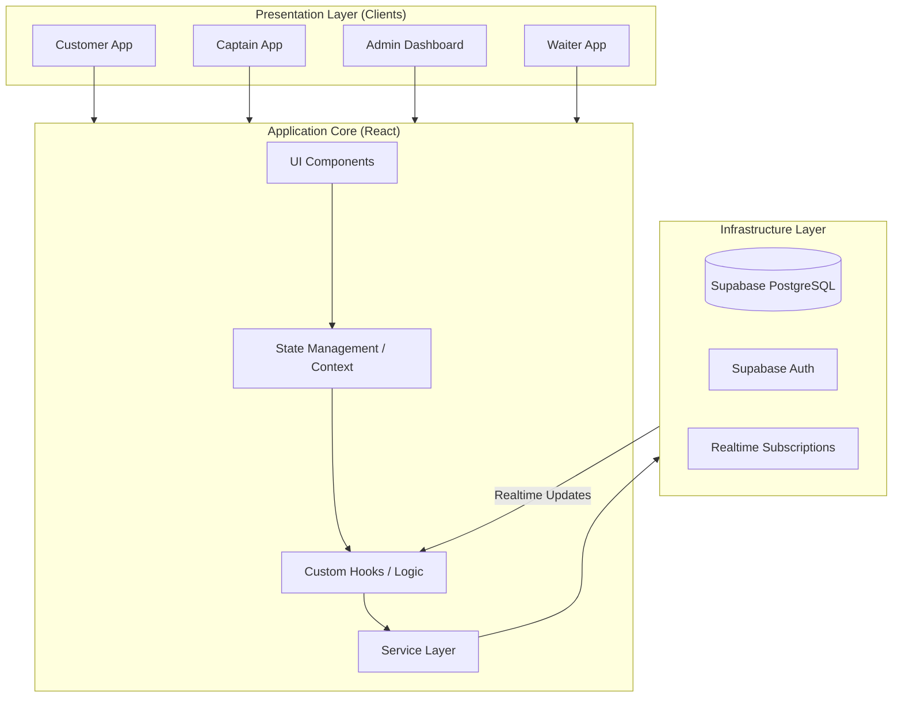
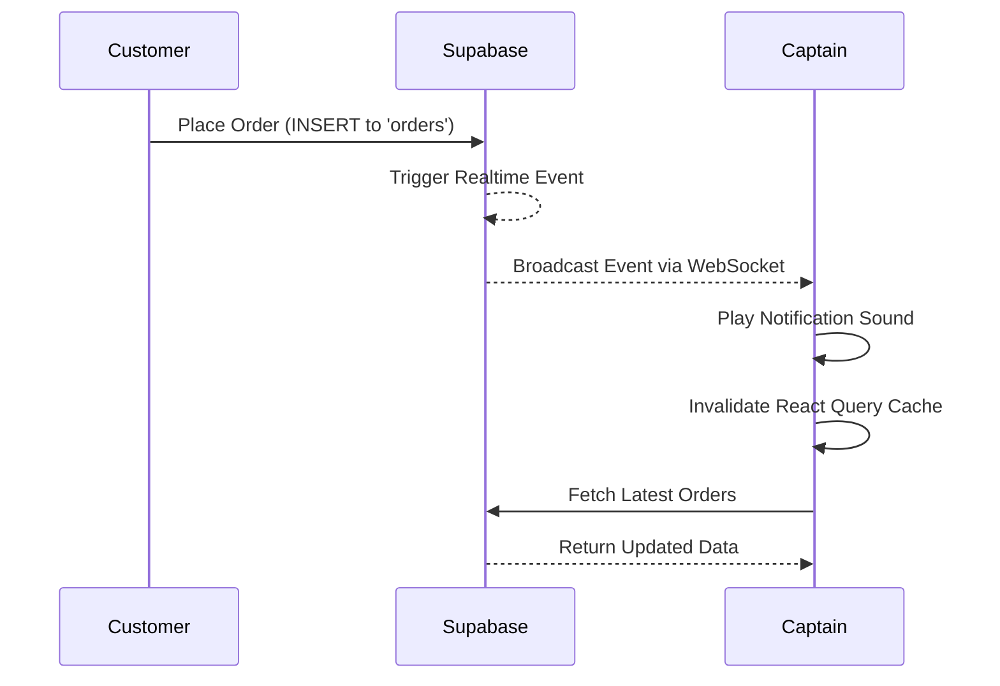

# 🏛️ Nyay Netra - Architecture & Design Document

> **Confidentiality Notice**: This document contains proprietary architecture designs for the POS system.

## 1. Executive Summary

This document outlines the software architecture, design patterns, and system components of the POS system. The architecture is designed with **Clean Architecture** principles in mind, focusing on scalability, maintainability, and separation of concerns.

## 2. System Architecture

The POS system follows a modernized Client-Server architecture utilizing a Backend-as-a-Service (BaaS) model powered by Supabase.

### 2.1 High-Level Architecture Diagram



## 3. Clean Architecture Implementation

We have transitioned towards a **Clean Architecture** approach to ensure the business logic is independent of the UI and external frameworks.

| Layer | Responsibility | Components |
| :--- | :--- | :--- |
| **Domain Layer** | Core business rules and types. | `src/types/`, `src/lib/utils` |
| **Data/Service Layer** | Data access, APIs, and external services. | `src/services/`, `supabase` |
| **Presentation Layer** | UI, styling, and user interaction. | `src/components/`, `src/pages/` |
| **Application Layer** | Use cases, state, and business flow. | `src/hooks/`, `src/contexts/` |

### 3.1 Directory Structure

```text
src/
├── assets/         # Static assets (images, icons)
├── components/     # Reusable UI components (Presentation)
├── contexts/       # Global state management (Application)
├── hooks/          # React Query and custom logic (Application)
├── integrations/   # Third-party setups (Infrastructure)
├── lib/            # Utility functions (Domain/Shared)
├── pages/          # Route components (Presentation)
└── types/          # TypeScript definitions (Domain)
```

## 4. Key Design Decisions

### 4.1 State Management
- **Local State**: Managed via React `useState` and `useReducer`.
- **Server State**: Managed via `@tanstack/react-query` to cache, dedup, and synchronize data with Supabase.
- **Global UI State**: Context API is used for theme, authentication, and table sessions.

### 4.2 Realtime Synchronization
To ensure captains and kitchens get instant updates without polling, we utilize Supabase's PostgreSQL realtime subscriptions.



## 5. Security & Authentication

- **Row Level Security (RLS)**: Enforced at the database level to ensure users (Customers, Captains, Admins) can only access data they are authorized to see.
- **JWT Tokens**: Used for secure API communication.

## 6. Future Architectural Considerations

- **Micro-frontends**: As the admin portal grows, splitting the admin and customer apps into separate builds.
- **Offline First**: Implementing service workers to allow order queuing when the internet connection is unstable.
