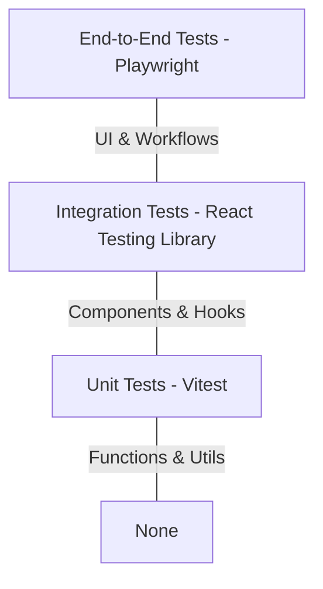

# 🧪 Testing Documentation

> **Frameworks**: Vitest / Playwright
> **CI/CD**: GitHub Actions

## 1. Overview

Quality assurance in Nyay Netra is paramount. This document outlines our testing strategies, including unit, integration, and end-to-end (E2E) testing.

## 2. Test Pyramid



## 3. Unit Testing

Unit tests focus on isolated utility functions and pure logic.

- **Tools**: Vitest
- **Location**: Adjacent to the file being tested (e.g., `utils.test.ts` next to `utils.ts`).

### Example
```typescript
import { formatCurrency } from './utils';

test('formats currency correctly', () => {
  expect(formatCurrency(100)).toBe('₹100.00');
});
```

## 4. Integration Testing

Integration testing ensures that React components mount correctly and custom hooks interact with the Supabase client mock appropriately.

- **Tools**: Vitest + `@testing-library/react`
- **Location**: `src/__tests__/integration/`

### Example
```typescript
import { render, screen } from '@testing-library/react';
import { TableContext } from '../contexts/TableContext';

test('renders active table session', () => {
  render(<TableContext.Provider value={...}><MyComponent /></TableContext.Provider>);
  expect(screen.getByText(/Table 5/i)).toBeInTheDocument();
});
```

## 5. End-to-End (E2E) Testing

E2E testing simulates real user behaviors across the Customer, Captain, and Admin interfaces.

- **Tools**: Playwright
- **Location**: `tests/e2e/`

### Key Scenarios Tested
| Scenario | Role | Description |
| :--- | :--- | :--- |
| **QR Code Scan** | Customer | Validates URL routing and session initiation. |
| **Place Order** | Customer | Ensures items enter cart and order successfully. |
| **Approve KOT** | Captain | Verifies real-time update and KOT printing logic. |
| **Checkout** | Customer/Captain | Completes billing lifecycle. |

## 6. Running Tests Locally

```bash
# Run unit and integration tests
npm run test

# Run E2E tests in headed mode
npx playwright test --headed
```
